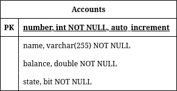

# r1-muhammad
Controlador de REST API hecho con Spring Boot, administrado paquetes con Maven, conectandose a MySQL (MariaDB)

## REQUISITOS PARA CORRER
 - Java 17
 - MySQL
    - Servicio MySQL activo y corriendo de fondo
    - Accesso a un usuario de la sesion 
      de MySQL que pueda crear una base de datos

## Cambios requeridos para probar
Debe cambiar las siguientes variables encontradas en el archivo `./src/main/resources/application.properties`
```properties
spring.datasource.username=root
spring.datasource.password=abcdroot1234
```
Reemplazar las credenciales predeterminadas, por las credenciales respectivas del usuario de MySQL que pueda crear una base de datos, la cual se llamara `r1backenddb`.

## Estructura de la tabla en MySQL
La siguiente es la estructura de la tabla `account` dentro de la base de datos
`r1backenddb`



 - `number`: Columna que cumple el rol de IDENTIFICACIÓN o llave principal de la
             tabla. Al añadir nuevas cuentas, este atributo se puede ignorar, dado
             a que es asignado automaticamente por la tabla. Tipo: Integer
 - `name`: Nombre del usuario al que le pretenece la cuenta. Tipo: String
 - `balance`: Columna que representa los *creditos* que tiene en la cuenta el 
              usuario. Tipo: Double
 - `state`: Columna que representa el estado de la cuenta (1 = activa, 0 = inactiva)
            Tipo: Boolean


## Explicación del API

### Metodos GET
Encontramos aqui dos metodos GET.

 - **GET** http://localhost:8080/api/v1/accounts

   Este metodo da el listado de todas las cuentas **activas** (cuyo atributo `state == 1`)


 - **GET** http://localhost:8080/api/v1/accounts/{id}

   Este metodo devuelve la info específica del usuario cuyo **number** (el cual uso como identificador) el que esta en el URL
   
   Al usar este metodo GET, tambien te da la información de cuentas que pueden estar **inactivas**

### Metodos POST
El único metodo POST implementado en la API es el siguiente

- **POST** http://localhost:8080/api/v1/accounts

  Este metodo crea una cuenta, siempre y cuando los atributos `name`, `balance`, y `state`, son definidos en el *body* de la llamada, y que contengan valores validos.
  
  Una vez la llamada es realizada correctamente, este metodo devuelve los datos del usuario creado en formato JSON.


### Metodos PUT
El único metodo PUT implementado en la API es el siguiente

- **PUT** http://localhost:8080/api/v1/accounts/{id}

  Este metodo intenta modificar la información de la cuenta cuyo **number** es el que esta en el URL.

  Este metodo primero verifica que exista una cuenta con el numero de cuenta referido, y que los atributos que quieran ser modificados sean validos. No se tienen que cambiar todos los atributos a la vez (podrías por ejemplo, solo cambiar el `state` de la cuenta), pero el atributo que existe en el *body* debe ser valido.

  Si el cambio es reconocido como valido, entonces realiza el cambio en la tabla y devuelve la información del usuario con la nueva data

  Por el otro lado, si una cuenta con el numero de cuenta {id} no existe, o ningun atributo de los que se busca (ya sea `name` o `balance` o `state`)es añadido al *body* del request, devuelve error 404 sin body.

### Metodos DELETE
El único metodo DELETE implementado en la API es el siguiente

- **DELETE** http://localhost:8080/api/v1/accounts/{id}

  Este metodo intenta modificar la información de la cuenta cuyo **number** es el que esta en el URL.

  Este metodo primero verifica que exista una cuenta con el numero de cuenta referido. Si existe, le modifica el campo `state` a falso, para desactivar la cuenta.

  Si la cuenta con numero de cuente {id} existe, devuelve la información de la cuenta actualizada, con su nuevo estado de 'falso', significando que la cuenta esta desactivada.
  Pero si no consigue la cuenta, entonces devuelve error 404 com cabecera sin body.

## Posibles Mejoras a Futuro

1. El deployment de la base de datos MySQL sea manejado a travez de un contenedor docker, similar a la [guia de spring con MySQL](https://spring.io/guides/gs/accessing-data-mysql)

2. Agregar validacion de strings, ya sea con regex, o con anotaciones de spring boot